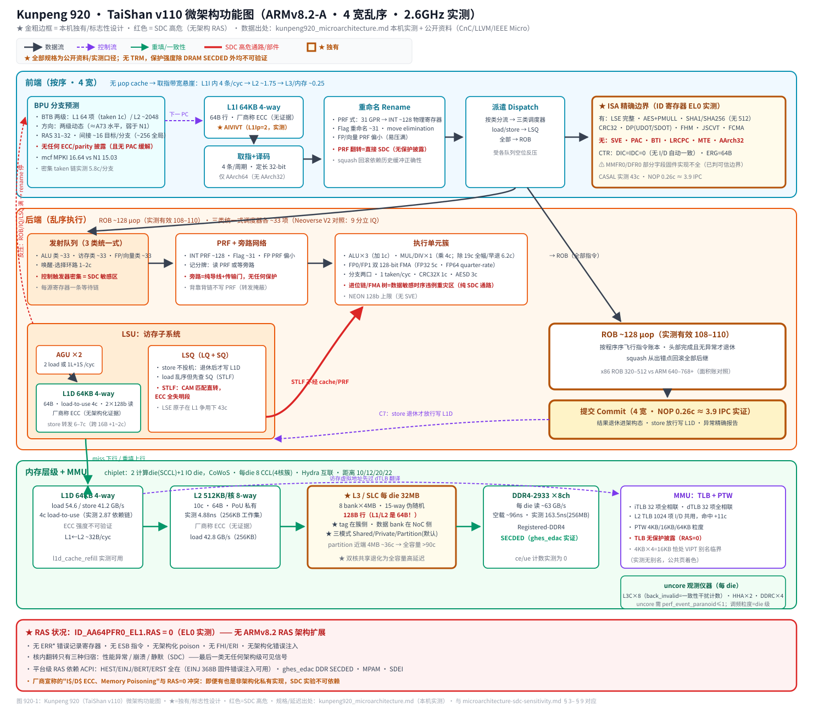
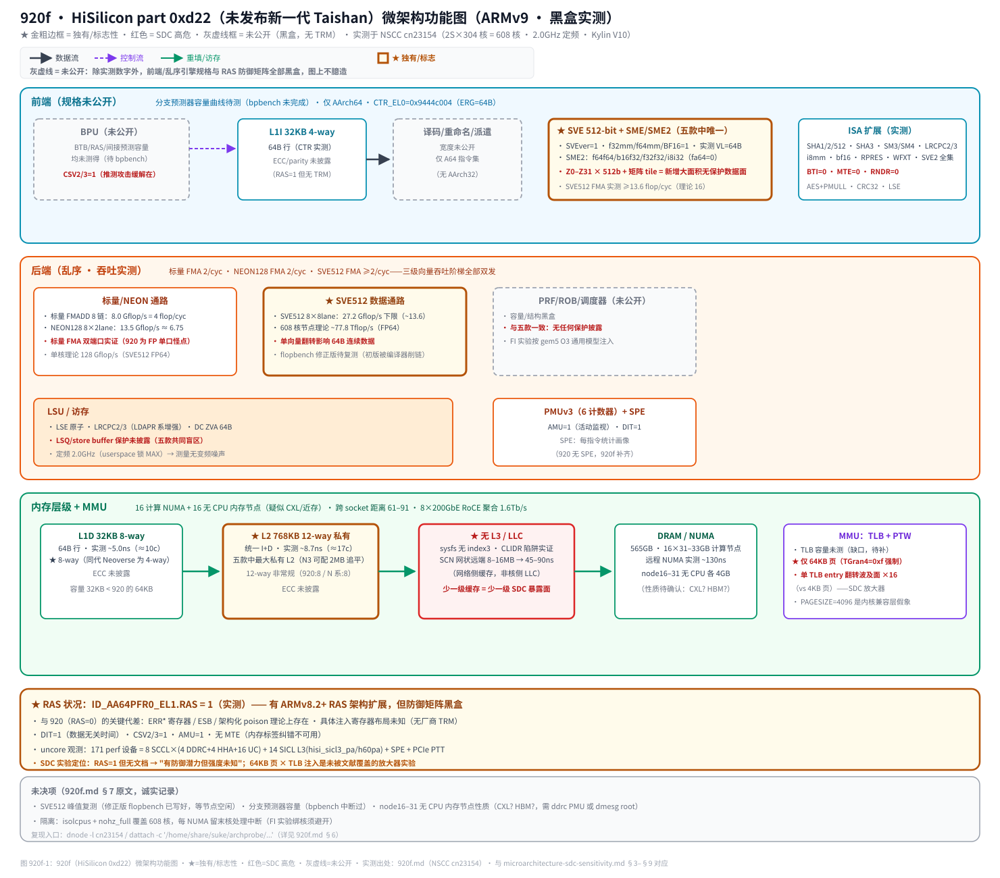
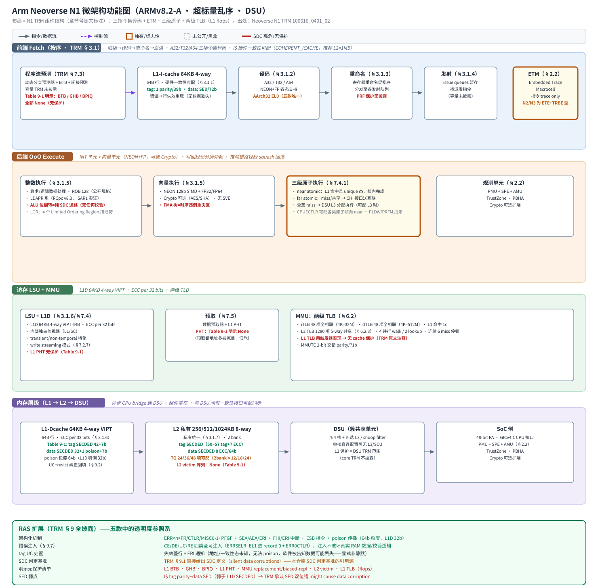
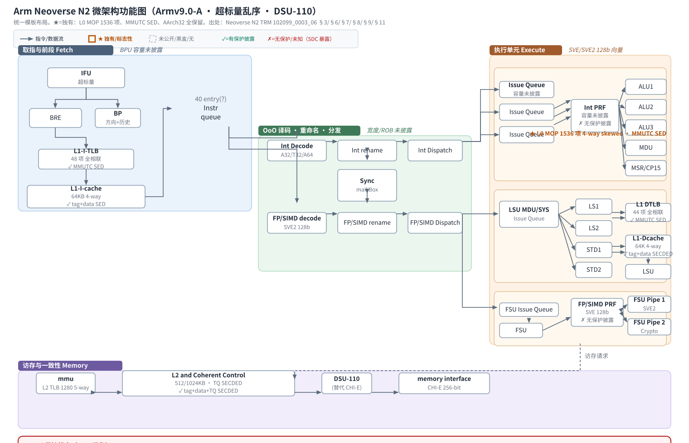
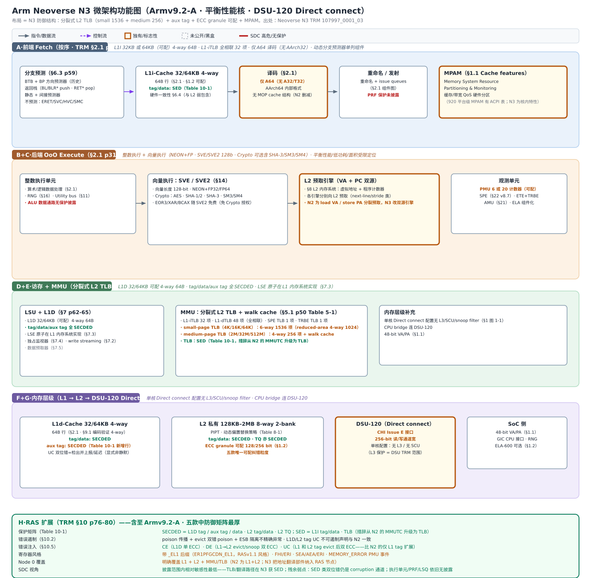

# ARM64 五款 CPU 微架构 × SDC 敏感性对比研究

> 调研日期：2026-09-18。
> 目的：为 CPU 微架构层面的 **SDC（Silent Data Corruption，静默数据损坏）敏感性分析**提供系统化的横向底表。
> 纵轴 = 微架构部件（按体系结构学界公认的前端/乱序执行引擎/访存/缓存层次/地址转换/RAS 多级分类），
> 横轴 = 五款芯片：**Kunpeng 920（TaiShan v110）、920f（HiSilicon 0xd22 新核）、Neoverse N1、N2、N3**。
> 每格尽量标注信息来源；无数据处显式标注「未公开/TRM 未披露」，绝不臆造。

---

## 0. 信息来源与可信度分级

| 芯片 | 主要来源 | 性质 | 可信度 |
|---|---|---|---|
| Kunpeng 920 | `kungpeng/kunpeng920_microarchitecture.md`（本机实测 + ID 寄存器直读 + 微基准）、`kunpeng920.md`（公开资料汇总）、`kunpeng920_pmu_events.md` | 本机 128 核 TaiShan 200 实测；公开规格为 CnC/LLVM/IEEE Micro | 实测部分 100%；公开规格部分为厂商/第三方宣称 |
| 920f | `kungpeng/920f.md`（NSCC cn23154 实测） | 未发布 CPU，仅黑盒实测 | 实测部分 100%；无 TRM |
| Neoverse N1 | `neoverse-n1-trm/neoverse_n1_trm.md`（= TRM 100616_0401_02 全文） | Arm 官方 TRM | 官方文档 100% |
| Neoverse N2 | `neoverse-n2-trm/arm_neoverse_n2_core_trm_102099_0003_06_en.pdf`（本文引用页码均出自该 PDF） | Arm 官方 TRM | 官方文档 100% |
| Neoverse N3 | `neoverse-n3-trm/arm_neoverse_n3_core_technical_reference_manual_107997_0001_03_en.pdf` | Arm 官方 TRM | 官方文档 100% |

**SDC 判定基准**（引 Neoverse N1 TRM §9.1 原文）：故障后果二分——「被掩盖、不影响系统输出的良性/假错误」 vs「影响系统服务接口并导致失败的**静默数据损坏**」。微架构层面 SDC 敏感性 = **单位粒子翻转在部件 X 中最终演化为 SDC 的概率**，由四个因子决定：
1. **有无保护**（无 ECC/parity → 单比特翻转直接改变状态）；
2. **保护强度**（SED parity 只检 1 位，双位翻转漏检 → TRM 原文明言 "This might cause data corruption"；SECDED 检 2 位）；
3. **数据流向**（部件承载"数据面"还是"控制面"：数据面错误直接进指令结果；控制面错误多半表现为崩溃/挂起/性能异常，反而不是 SDC）；
4. **暴露窗口**（状态驻留时间 × 是否会写回下游存储层级）。

---

## 1. 基本信息

| | Kunpeng 920 | 920f | Neoverse N1 | Neoverse N2 | Neoverse N3 |
|---|---|---|---|---|---|
| 厂商/系列 | HiSilicon TaiShan | HiSilicon（未发布） | Arm Neoverse | Arm Neoverse | Arm Neoverse |
| 微架构名 | TaiShan v110 (TSV110) | part 0xd22（"72F5"，新一代 Taishan，未公开命名） | Neoverse N1 | Neoverse N2 | Neoverse N3 |
| 架构版本 | ARMv8.2-A | ARMv9（SVE2/SME2；PFR0 实测） | ARMv8.2-A | Armv9.0-A（含至 v8.5 特性） | Armv9.2-A（含至 v8.7 特性） |
| MIDR part | 0xd01 (0x481fd010) | 0xd22 (0x480fd220) | — | — | — |
| 定位 | 7nm 数据中心核，chiplet | HPC/超算核（608 核/节点） | 高性能基础设施核 | 高性能/平衡核 | 平衡性能、低功耗、面积受限核 |
| 流水线 | 4-wide OoO，~8 级，PRF 后端 | 未知（SVE512 双 FMA 实测） | 超标量变长 OoO | 超标量 OoO（TRM 未公开宽度） | 超标量 OoO（TRM 未公开宽度） |
| 簇/共享单元 | 4 核 CCL 共享 L3 tag；SCCL=die | 38 核/NUMA 节点（节点即调度域） | DSU 簇（≤4 核 + L3 可选） | DSU-110 簇 | DSU-120（Direct connect 单核配置无 L3/SCU） |
| 内存/页 | DDR4-2933 8通道；4KB/16KB/64KB granule | 565GB；**仅 64KB 页**（TGran4=0xf） | 48-bit PA | 48-bit PA（4/16/64KB granule） | 48-bit VA/PA |
| ISA 边界要点 | 无 SVE/PAC/BTI/LRCPC/AArch32；有 LSE | SVE512+SME2+SHA3/SM3/SM4+LRCPC2/3；BTI=0,MTE=0 | AArch32 EL0；LDAPR(v8.3) | SVE/SVE2 128b 向量；AArch32+AArch64 | 仅 A64；SVE/SVE2 128b 向量 |
| 主频（实测/典型） | 2.6 GHz 固定 | 2.0 GHz 定频 | ~2.6-3.1 GHz | ~2.4-3.0 GHz | ~2.4-3.0 GHz |

来源：920 实测 lscpu/MIDR；920f 实测（920f.md §1）；N1 TRM §2.2；N2 TRM ch2 p30；N3 TRM ch1 p17。

---

## 1.5 各芯片微架构功能图（★ = 独有/标志性设计）

以下五张图采用统一泳道格式（前端按序 / 后端乱序 / 内存层级+MMU，外加 RAS 横幅），
**金粗边框（★）标记该芯片在本组五款中独有或标志性的设计**，红色标记 SDC 高危部件/通路，
灰虚线框（920f）表示黑盒未公开。图内数字均与本文各节表格同源，可交叉验证。

### Kunpeng 920（TaiShan v110）



独有/标志性：L3/SLC 三模式（Shared/Private/**Partition 默认**）+ **128B 行**（L1/L2 是 64B）+ tag 在簇侧；
无 µop cache（取指带宽悬崖）；**RAS=0**（无架构化 RAS，全图唯一的"裸奔"平台）；AIVIVT L1I；NEON 128b 上限。

### 920f（HiSilicon part 0xd22，未发布）



独有/标志性：**SVE 512-bit + SME/SME2**（五款唯一宽向量）；**768KB/12-way L2**（非常规配置）；
**无 L3/LLC**（少一级缓存暴露面）；**64KB 强制页**（TLB 翻转波及面 ×16 放大器）；RAS=1 但防御矩阵黑盒。

### Neoverse N1



独有/标志性：**ETM**（指令 trace，N2/N3 改 ETE+TRBE）；**AArch32 EL0**（五款唯一 32 位支持）；
**三级原子执行**（near L1 → far CHI → DSU L3）；L2 TQ 24/36/48 项可配；TRM 明示无保护清单最完整
（BTB/GHB/BPIQ/PHT/L2 victim/L1 TLB flops）——本组"披露透明度参照系"。

### Neoverse N2



独有/标志性：**L0 MOP 缓存 1536 项 4-way skewed**（存已译码优化指令，SED 弱保护×高命中×指令面）；
**MMUTC 拉进 SED**（N1 仅 2-bit 交错 parity）；AArch32 全保留（A32/T32/A64）；write streaming L1+L2 双级；
load VA / store PA 分裂预取器。

### Neoverse N3



独有/标志性：**分裂式 L2 TLB**（small-page 1536 项 6-way + medium-page 256 项 4-way + walk cache）；
**TLB 整体 SED**（N2 仅 MMUTC）；**L1D aux tag SECDED**（新增披露行）；**L2 ECC granule 128/256b 可配**；
**MPAM** 核内特性；CHI Issue E 256-bit 接口；PMU 6/20 计数器可配；RAS Node 0 明确覆盖 MMU/TLB；
无 MOP 结构（相对 N2 删减）——披露范围内 SDC 防御最厚。

---

## 2. 纵轴分类体系（体系结构公认分层）

```
A. 指令供给前端 (Instruction Frontend)
   A1 指令缓存 L1I$        A2 分支预测 (BTB/方向预测器/RAS/间接预测)
   A3 译码与 µop 缓存      A4 指令 TLB (ITLB)
B. 乱序执行引擎 (OoO Core)
   B1 寄存器重命名 ( Rename / PRF )   B2 调度器 (Issue Queue)
   B3 ROB / 提交           B4 执行单元 (INT/FP/向量)
C. 访存与数据通路 (Memory Pipeline)
   C1 AGU / LSU / Store Buffer   C2 原子与同步单元
   C3 数据预取器
D. 缓存层次 (Cache Hierarchy)
   D1 L1D$      D2 L2$ (私有)     D3 L3/SLC (共享)    D4 一致性协议/目录
E. 地址转换 (Address Translation)
   E1 DTLB / L2 TLB    E2 MMU 翻译缓存/页表遍历
F. 可靠性/ RAS 与错误处理 (Reliability)
   F1 RAM 保护 (ECC/parity 矩阵)   F2 架构化 RAS (寄存器/异常/ESB/poison)
   F3 错误注入    F4 平台 RAS 栈 (ACPI/EDAC)
```

以下各节即按此纵轴逐层展开，每层一张「部件 × 5 芯片」表。

---

## 3. A. 指令供给前端

### A1. L1 指令缓存

| | 920 (v110) | 920f | N1 | N2 | N3 |
|---|---|---|---|---|---|
| 容量/相联 | 64KB / 4-way / 64B | 32KB / 4-way / 64B (CTR 实测) | 64KB / 4-way / 64B | 64KB / 4-way / 64B | **32KB 或 64KB**（可配）/ 4-way / 64B |
| 索引方式 | AIVIVT（CTR_EL0.L1Ip=2，实测） | 未测 | — | — | 编码表用 VA bits[13:6]（VIPT 型） |
| 硬件一致性 | 无（DIC=0 实测） | 未测 | 可配（COHERENT_ICACHE，推荐 L2=1MB） | §7.4 支持 | BROADCASTICINVAL=1 时与 L2 弱包含 |
| ECC/保护 | 厂商宣称 ECC（无架构化证据，RAS=0） | 未披露 | tag: 1 parity bit/39b；data: SED/72b；错误→行失效重取 | tag+data: SED parity | tag+data: SED parity |

SDC 视角：L1I 属**指令面**——翻转直接改变被执行的指令流，是 SDC 的**最高危入口之一**；但 N1/N2/N3 的 SED 仅检单比特，TRM 原文（N2 §11.1）：SED RAM 双位错误「core does not detect … might cause data corruption」——**架构层面承认 I$ 双位翻转可致 SDC**。SED 检出后的恢复策略是失效重取（无数据丢失），这比 L1D 的 poison 更干净。920 的 RAS=0 意味着其 ECC 声称无法用标准 ERR 寄存器验证，I$ 保护强度**未知**。

### A2. 分支预测

| | 920 | 920f | N1 | N2 | N3 |
|---|---|---|---|---|---|
| BTB | L1 64 项；L2 ~2048 项 | 未测 | BTB（容量未披露） | BTB（容量未披露） | BTB（容量未披露） |
| 方向预测器 | 两级动态（≈A73 水平） | 待测（bpbench 未完成） | 动态预测器 | 分支方向预测器（历史） | BP 预测器（历史） |
| 返回栈 RAS | 31–32 项 | 未测 | 有 | 有 | 有（BL/BLR* push；RET* pop） |
| 间接预测 | ~256 目标 | 未测 | 有 | 间接分支预测器 | 间接分支预测器 |
| **保护** | 无 ECC（公开资料无任何提及） | 未披露 | **BTB/GHB/BPIQ 全部无保护**（TRM Table 9-1 明示 None） | TRM Table 11-1 **未列** BTB/GHB → 未披露 | TRM Table 10-1 **未列** → 未披露 |

SDC 视角：分支预测结构是**控制面**——翻转通常导致 mispredict（性能损失）或错误路径取指（被推测执行后丢弃），**理论上不易直接产生体系结构可见的 SDC**；但例外路径存在：BTB 目标翻转 + 推测窗口内的副作用（如非瞬时内存操作）或与 PAC 缺失叠加（920 无 PAC）时可能放大攻击面。注意 N1 TRM 明确把 BTB/GHB/BPIQ 列为 **None（无保护）**——这是 Arm 官方文档中少见的"承认无保护"的部件，对 SDC 故障注入实验是**最容易命中且必然漏检的靶点**。

### A3. 译码与 µop 缓存

| | 920 | 920f | N1 | N2 | N3 |
|---|---|---|---|---|---|
| 译码宽度 | 4/cyc | 未知 | A32/T32/A64 | A32/T32/A64 | 仅 A64 |
| µop/MOP cache | **无**（代码溢出 L1i 后带宽 4→0.25 条/cyc 骤降） | 未披露 | 无 MOP（N1 无此结构） | **L0 MOP 1536 项，4-way skewed**，存已译码优化指令 | TRM 组件图与编码章均无 MOP → **无（相对 N2 删减）** |
| 保护 | — | — | — | MOP data: SED parity | — |

SDC 视角：MOP cache 命中率高（N2 主打结构），翻转 = 译码后指令被静默篡改，且**不经取指级校验**——N2 用 SED 覆盖单比特；双位翻转同 TRM 承认可致 corruption。920 无 µop cache，反而少一个 SDC 暴露面。

### A4. 指令 TLB（详见 E 节统一表）

---

## 4. B. 乱序执行引擎

### B1-B3. 重命名/调度/ROB

| | 920 | 920f | N1 | N2 | N3 |
|---|---|---|---|---|---|
| ROB | ~128 µop（实测有效 108–110） | 未测 | 128（公开规格，TRM 未披露） | 未披露 | 未披露 |
| 调度器 | ALU/LS/FP 三类统一式，各 ~33 项 | 未测 | issue queues（TRM 未给容量） | issue queues | issue queues |
| INT PRF | ~128 项；Flag rename ~31 | 未测 | 未披露 | 未披露 | 未披露 |
| move elimination | 有 | 未测 | 未披露 | 未披露 | 未披露 |
| **保护** | 无（架构上无 RAS，实现未知） | 未披露 | TRM 未列任何保护 → 无披露 | 未披露 | 未披露 |

SDC 视角：PRF/ROB/调度器属于**数据面寄存器堆**——物理寄存器堆翻转 = 立刻改变在飞指令的操作数 → **直接 SDC**，且五款芯片均**未公开任何保护**（Arm TRM 的 RAS 章只覆盖 RAM 型缓存/TLB 结构，PRF 之类的触发器阵列不在列）。这是所有乱序核共同的 SDC 盲区，也解释了为何学术 FI 研究（gem5 FI/O3 寄存器注入）大量集中在 PRF。

### B4. 执行单元

| | 920 | 920f | N1 | N2 | N3 |
|---|---|---|---|---|---|
| 整数 | 3×ALU + 1×MUL/DIV(4cyc)；分支可占 2 ALU，1 taken/cyc | 未测 | INT 执行单元 | INT 执行单元 | INT 执行单元 |
| FP/向量 | 2×FP；FP32 FMA 2/cyc（128b），FP64 1/4 rate；FADD 4/FMUL 5/FMA 5–7 cyc | 标量 FMA 2/cyc；NEON128 2/cyc；**SVE512 FMA ≥2/cyc（实测 13.6 flop/cyc 下限）** | NEON 128b | NEON + **SVE/SVE2 128b 向量长度** | NEON + SVE/SVE2 128b 向量长度 |
| Crypto | AES+PMULL/SHA1/SHA256/CRC32 | AES/SHA1/2/512/SHA3/SM3/SM4 | 可选扩展 | 可选扩展（含 SM3/SM4） | 可选扩展（含 SHA-3；EOR3/XAR/BCAX 随 SVE2 免费给） |
| 关键延迟（实测） | int-mul 3.42、udiv 早退 6.2、CASAL 43、LDR 依赖链 2.87 | — | — | — | — |
| **保护** | 无公开信息 | 未披露 | 无披露 | 无披露 | 无披露 |

SDC 视角：ALU/FMA 内部位翻转直接进结果寄存器 → **纯 SDC 通路**，无任何校验（除非上层做算法级冗余）。文献中锁步/双核冗余针对的正是这里。五款均无披露，视作同等高危。

---

## 5. C. 访存与数据通路

### C1. LSU / Store Buffer

| | 920 | 920f | N1 | N2 | N3 |
|---|---|---|---|---|---|
| AGU/LSU | 2×AGU（2 load 或 1L+1S）/cyc | 未测 | load/store 单元 | LSU | LSU |
| L1D 访问 | 2×128b/cyc | — | — | — | — |
| store→load 转发 | 6–7 cyc（跨 16B 边界 +1–2） | 未测 | — | — | — |
| 原子 | LSE 完整；CASAL 实测 43 cyc（L1 争用） | LSE | near/far atomic：L1 unique 命中走 near，miss/共享走 CHI far atomic；LOR 4 region | LSE 原子（TRM §8.2） | LSE 原子（§7.3 在 L1 内存系统中实现） |
| 独占监视器 | 内部 exclusive monitor | 未测 | 内部 exclusive monitor（§7.4.2） | §8.3 | §7.4 |
| **保护** | 无披露 | 未披露 | 无披露（store buffer 不在 RAS 表中） | L2 TQ 在 RAS 表（SECDED）；L1 侧队列未列 | L2 TQ SECDED |

SDC 视角：load/store 队列与 store buffer 中翻转直接改变待写数据/地址 → **高概率 SDC**。N1/N2/N3 唯一披露的保护点是 **L2 Transaction Queue（SECDED）**；L1 侧 LSQ 未披露。

### C3. 数据预取器

| | 920 | 920f | N1 | N2 | N3 |
|---|---|---|---|---|---|
| 结构 | 标量/向量优化（厂商描述） | 未测 | L1 PHT（prefetch history table） | load 侧 VA 预取 L1+L2；store 侧 PA 仅预取 L2；另有 TLB prefetcher、region prefetcher（IMP_CPUECTLR_EL1 可控） | L2 预取引擎（VA+PC） |
| **保护** | 无披露 | 未披露 | **PHT 无保护（TRM Table 9-1 明示 None）** | 未列 | 未列 |

SDC 视角：预取器翻转多产生"多余/错误地址的取数"，错误数据进缓存但未被消费 → 一般被掩盖；**但预取错地址会污染一致性状态/功耗，属低危控制面**。N1 明示 PHT 无 ECC。

---

## 6. D. 缓存层次

### D1-D3. 容量/组织总表

| | 920 | 920f | N1 | N2 | N3 |
|---|---|---|---|---|---|
| L1D$ | 64KB/4-way/64B，VIPT，load-to-use 4 cyc | 32KB/**8-way**/64B（实测 ~10 cyc） | 64KB/4-way/64B，VIPT，ECC/32b | 64KB/4-way/64B | **32KB 或 64KB**/4-way/64B |
| L1I$ | 64KB/4-way | 32KB/4-way | 64KB/4-way | 64KB/4-way | 32KB 或 64KB/4-way |
| L2$ | 512KB/8-way/10 cyc 私有 | **768KB/12-way**/~17 cyc 私有统一 | 256/512/1024KB/8-way 私有（2 bank；TQ 24/36/48 项） | 512KB 或 1024KB/8-way 私有 | 128/256/512/1024/**2048KB**/8-way/2-bank/PIPT 私有 |
| L3/LLC | 每 die 32MB SLC（8 bank×4MB），**15-way 伪随机，128B 行**，tag 在簇侧；shared/private/**partition(默认)** 三模式 | **不存在**（sysfs 无 index3；SCN 远端 8–16MB 是网络侧缓存） | DSU 内可选 L3（TRM 范围外，DSU TRM 管） | DSU-110 L3（DSU TRM 范围） | Direct connect 单核配置无 L3/SCU |
| 行大小陷阱 | **L3=128B 而 L1/L2=64B** | 64B | 64B | 64B | 64B |
| 一致性 | Hydra/HHA 目录（edir-* PMU 可观测）；跨 die 环形 NoC | HCCS 类；NUMA 距离 61–91 跨 socket | DSU SCU+可选 snoop filter | DSU-110 SCU/snoop filter | DSU-120；CHI Issue E 接口 256-bit |

来源：920 sysfs 实测（sets=256/1024/2048）；920f 实测；N1 TRM §2.3/§3.1；N2 TRM p40/42；N3 TRM p31-33/67（Table 8-1）。

SDC 视角（缓存是 FI 实验主战场，本仓库 CHAOSCache 注入结论可直接映射）：
- **tag RAM 是最危险的缓存子结构**：tag 翻转 → 错误行命中 → 读出他人数据（伪共享式 SDC）或丢失写回。N2 TRM §11.2 原文："**Uncorrectable L1 data cache and L2 cache tag errors are not containable**"——架构承认 tag UC **不可遏制**；N1 的处置是失效整行 + ERI 通知（丢数据但**不静默**）。本仓库注入实证：tag→SDC `bd34ebf3da704050`，valid/dirty/repl/coh→Masked，与 TRM 叙述定性一致。
- **L3/SLC 的保护全部不在这三份 core TRM 范围内**（DSU/HHA 侧文档），Neoverse 三款 core TRM 只披露私有 L1/L2；920 的 L3 ECC 强度无公开证据。

### D4. 缓存 RAM 保护矩阵（SDC 敏感性的核心表）

| RAM | 920 | 920f | N1 | N2 | N3 |
|---|---|---|---|---|---|
| L1I tag | 声称 ECC（无证据） | 未披露 | 1 parity/39b | SED | SED |
| L1I data | 声称 ECC（无证据） | 未披露 | SED/72b | SED | SED |
| L0 MOP | （无此结构） | 未披露 | （无） | SED | （无此结构） |
| L1D tag | 声称 ECC | 未披露 | **SECDED**（42b+7 ECC；UC→evict-correct-refill） | **SECDED** | **SECDED** |
| L1D data | 声称 ECC | 未披露 | **SECDED**（32b+1 poison+7 ECC） | **SECDED** | **SECDED** |
| L1D aux tag | — | — | — | — | **SECDED**（N3 新增披露） |
| L2 tag | 声称 ECC | 未披露 | SECDED（50–57 tag bits+7 ECC） | SECDED | SECDED |
| L2 data | 声称 ECC | 未披露 | SECDED（8 ECC/64b） | SECDED | SECDED（ECC granule 可配 128/256b） |
| L2 TQ | — | — | SECDED（8 ECC/64b） | SECDED | SECDED |
| L2 victim | — | — | **None** | （表中未列） | （表中未列） |
| L2 uncore/DSU L3 | SLC 无公开数据 | 无 L3 | DSU TRM 范围 | DSU TRM 范围 | DSU TRM 范围 |

关键共性（N1/N2/N3 TRM 措辞一致）：SECDED RAM 的双位错被"检出并上报或延迟"，若发生在 **dirty 行**上则**数据可能丢失（显式通知，不是 SDC）**；SED RAM 的双位错**不检测，TRM 原文明言可能数据损坏（真 SDC）**；≥3 位错"可能检可能不检"（依 RAM 与位置）。

---

## 7. E. 地址转换

### TLB 组织与保护

| | 920 | 920f | N1 | N2 | N3 |
|---|---|---|---|---|---|
| iTLB | 32 项全相联 | 未测 | 48 项全相联（4K–32M） | **48 项全相联**（TRM Table 6-1） | 32 项全相联（4K–2M） |
| dTLB | 32 项全相联 | 未测 | 48 项全相联（4K–512M） | 44 项全相联 | 48 项全相联（4K–2M） |
| L2 TLB | 1024 项共用（命中 +11 cyc） | 未测 | 1280 项 5-way（4 并行 walk） | 1280 项 5-way | **分裂**：small-page 1536 项 6-way（或 1024 项 4-way reduced-area）+ medium-page 256 项 4-way + walk cache |
| 周边结构 | — | — | — | TRBE TLB 2 项；MMUTC；translation prefetcher | SPE TLB 1 项；TRBE TLB 1 项；translation prefetcher |
| **保护** | 无披露（RAS=0 → 架构上无 TLB RAS 机制） | 未披露（RAS=1 但无 TRM） | **L1 TLB = flops 无保护**（TRM 原文注释）；MMU translation cache 2-bit 交错 parity/71b；MMU replacement/biased-repl None | MMUTC: SED（Table 11-1） | **TLB: SED**（Table 10-1，措辞从 N2 的"MMUTC"改为"TLB"） |

SDC 视角：TLB 翻转 = 错误 VA→PA 映射 → **load/store 落错物理页**。若目标页恰好有写权限，是教科书级 SDC（写坏别人的页且无异常）；若权限位翻转则多为 abort（非 SDC）。N1 明示 L1 TLB 用触发器实现**无保护**；N2/N3 把 MMU 缓存拉进 SED。TLB 的 SDC 敏感性还与页大小相关：920f 强制 64KB 页 → 同样 1 项 TLB entry 覆盖 16 倍地址空间，**单次 entry 翻转的波及面 ×16**（对 SDC 是放大器）。

---

## 8. F. RAS 与错误处理（SDC 敏感性的"防御纵深"）

### F1. 架构化 RAS 支持

| | 920 | 920f | N1 | N2 | N3 |
|---|---|---|---|---|---|
| ID_AA64PFR0.RAS | **0（实测，无 ARMv8.2 RAS）** | **1（实测）** | 实现完整 RAS 扩展 | v9.0 RAS 全量 | v9.2 RAS 全量 |
| 错误记录寄存器 ERR* | 无 | 有（无 TRM 细节） | ERR<n>FR/CTLR/MISC0-3 | 同 + ERR<n>PFGF | 同（寄存器带 _EL1 后缀，RASv1.1 风格：ER1PFGCDN_EL1） |
| 中断 | — | — | FHI/ERI | FHI(nCOREFAULTIRQ)/ERI(nCOREERRIRQ) | 同 |
| 消费时报错 | — | — | SEA/AEA/ERI | SEA/AEA/ERI | SEA/AEA/ERI |
| ESB 指令 | 无 | 有 | 有 | 有 | 有 |
| Poison 传播 | 无架构机制（厂商私有） | 有（架构） | 64b 粒度（L1D 32b）；tag UC→失效+ERI | 总线 poison 属性；evict 双错 poison | 同 N2 |
| 错误注入 | 无架构接口 | 未知 | CE/DE/UC 可注入 | CE(L1D 单 ECC)/DE(L1→L2 evict 双 ECC 或 snoop)/UC(L1 tag evict 后双 ECC) | CE/DE/UC（UC 定义为 L1 **和** L2 tag） |
| PMU 联动 | ghes_edac 平台计数 | SPE/PMUv3 | — | MEMORY_ERROR 事件 | MEMORY_ERROR 事件 |
| 节点划分 | — | — | Node0=L1+L2 | Node0=L1+L2 私有存储系统 | Node0=L1+L2+**MMU/TLB**（N3 明确纳入） |

### F2. 平台级 RAS 栈

| | 920（本机实测） | 920f | N1/N2/N3 |
|---|---|---|---|
| ACPI | HEST/EINJ/BERT/ERST 全在（EINJ 368B → **固件级错误注入可用**）；MPAM；SDEI | 未探（root 不可及） | SoC 集成方决定 |
| EDAC | ghes_edac，DDR4 RDIMM **SECDED**（mc0，ce/ue 计数实测为 0） | 未知 | — |
| PCIe | AER（厂商宣称） | Gen4 RC | — |
| uncore PMU | L3C/HHA/DDRC 每 die 全套（back_invalid=核间一致性干扰计数器） | 171 perf 设备（8 SCCL×(4 DDRC+4 HHA+16 UC)+14 SICL L3） | DSU 侧 |

### F3. 诚实性标注（重要）

- kunpeng920.md 声称"指令/数据缓存 ECC、Memory Poisoning、MCA、99.999% 可用性"——**与同机实测 ID_AA64PFR0_EL1.RAS=0 直接冲突**。结论：920 有**非架构化**（non-architectural）的 ECC 实现（无 ERR* 编程模型、无 ESB、无架构 poison），平台 RAS 依赖 ACPI/GHES；其宣传口径不能等同于 Neoverse 级别的架构化 RAS。SDC 实验中**不能假设 920 有 poison 传播/ERI 等机制**。
- 920f RAS=1 仅说明架构授权存在，错误注入寄存器布局/保护矩阵**无厂商 TRM**，黑盒。

---

## 9. SDC 敏感性横向分析

### 9.1 敏感性排序（部件级，五款共性 + 差异）

按「无保护/弱保护 × 数据面 × 长驻留」三因子，微架构部件 SDC 敏感性从高到低：

| 排名 | 部件 | 保护现状（最优者） | SDC 机理 | 五款中最危险 |
|---|---|---|---|---|
| 1 | **执行单元/ALU/FMA 数据通路** | 全部无保护（无披露） | 运算中翻转直接进结果 | 全部等同高危 |
| 2 | **PRF/ROB/调度器触发器阵列** | 全部无保护（不在 RAS 表） | 在飞指令操作数/目的寄存器静默改写 | 全部等同高危 |
| 3 | **L1/L2 cache tag RAM** | SECDED（N1/N2/N3）；双位错仍不可遏制 | 错误命中→读错行/丢写回；UC 不可遏制 | 920（无架构 RAS，tag 保护未知）；N1/N2/N3 双位错场景 |
| 4 | **TLB/页表缓存** | N3 TLB SED / N2 MMUTC SED / N1 L1 TLB **flops 无保护** | 错误 VA→PA→写错物理页 | N1（L1 TLB）；920f（64KB 页放大波及面 ×16） |
| 5 | **L1I$/MOP（SED）** | SED 只检 1 位 | 双位翻转=静默改指令流（TRM 承认） | N2（多一个 1536 项 MOP 暴露面） |
| 6 | **LSQ/store buffer** | 无披露（仅 L2 TQ SECDED） | 待写数据/地址翻转 | 全部 |
| 7 | **BTB/GHB/预测器** | N1 明示 None；N2/N3 未披露 | 多为控制面→mispredict；间接 SDC 需特定推测路径 | 920（且无 PAC） |
| 8 | **预取器 PHT** | N1 明示 None | 错误预取多被掩盖（数据未被消费） | 低危 |
| 9 | **L1D/L2 data（SECDED）** | SECDED+poison | 单位纠、双位检出并通知（丢数据但不静默） | 相对最安全 |
| 10 | **DDR（平台层）** | 920: RDIMM SECDED+ghes_edac | 双位错不可纠但可检 | 平台层，非微架构 |

### 9.2 芯片级 SDC 敏感性画像

- **Kunpeng 920**：**敏感性最高**。RAS=0 → 无架构化错误记录/ESB/poison，任何核内翻转只有"性能异常/崩溃/静默"三种归宿，其中"静默"无任何架构级可见信号；cache ECC 为厂商私有实现，强度不可验证；L3 128B 行 + tag 在簇侧的设计让 tag 翻转的波及面更大（一行 128B）。对 SDC 实验而言它是"最坏情况"平台，也是本仓库 gem5 FI 建模的主要对象。
- **920f**：架构上 RAS=1（有防御潜力），但无 TRM → 防御矩阵黑盒；**无 LLC** → 缓存暴露面反而小于 920（只有 L1D 32KB+L2 768KB），但 **64KB 强制页**放大 TLB 类翻转的波及面。SME/SVE512 的巨型向量寄存器（Z0–Z31 × 512b + 矩阵 tile）是新增的**无保护数据面**——单次向量寄存器翻转影响 64B 连续数据。
- **Neoverse N1**：RAS 矩阵披露最完整（连 None 都写明）；薄弱点：L1 TLB（flops 无保护）、BTB/GHB/BPIQ/PHT/L2 victim 无保护、I$ 仅 SED。作为"披露透明度最高"的参照系。
- **Neoverse N2**：在 N1 基础上把 MMUTC 拉进 SED、MOP cache 有 SED、其余同 N1；无新增明显弱点；数据面 SDC 防御 ≈ N1。
- **Neoverse N3**：保护矩阵最厚——TLB 明确 SED、L1D aux tag 新增 SECDED、L2 ECC granule 可配 256b（更细纠错粒度）、RAS 节点明确覆盖 MMU/TLB。**相对 SDC 敏感性最低**（在披露范围内）。

### 9.3 对本仓库 FI/SDC 研究的可操作结论

1. **注入靶点优先级**（依 §9.1 排序）：O3 PRF/执行单元 > cache tag > TLB > I$/MOP > 预测器。现有 CHAOSCache tag→SDC 实证（`bd34ebf3da704050`）落在第 3 位靶点，结论可推广到五款芯片（tag 语义跨架构同构）。
2. **920 是 SDC 上界样本**：无架构 RAS → 所有"检出/延迟/poison"防御为 0，FI 结果直接给出裸敏感性基线；N1/N2/N3 的同点注入可量化"RAS 防御削减了多少 SDC"。
3. **920f 的 64KB 页 × TLB 注入**是一个未被文献覆盖的放大器实验设计点。
4. **MOP cache（N2）** 是 SED 弱保护 × 高命中率 × 指令面的三重叠加，值得单独建注入模型（920/N3 无此结构，天然对照组）。
5. **双比特注入**是区分 SED 与 SECDED 防御强度的关键实验变量：SED RAM（I$/MMUTC/TLB）双位错是 TRM 承认的 SDC 通道，SECDED RAM 双位错则转为"显式丢数据"（非 SDC）。

---

## 附：五款芯片文档索引

| 芯片 | 文件 | 备注 |
|---|---|---|
| Kunpeng 920 | `kungpeng/kunpeng920_microarchitecture.md` | 实测主文档（sysfs/ID 寄存器/微基准/ACPI） |
| Kunpeng 920 | `kungpeng/kunpeng920.md` | 公开资料汇总（含与实测冲突的 RAS 宣称，见 §8.F3） |
| Kunpeng 920 | `kungpeng/kunpeng920_pmu_events.md` | PMU 事件全表（含 uncore） |
| 920f | `kungpeng/920f.md` | NSCC cn23154 实测 |
| Neoverse N1 | `neoverse-n1-trm/neoverse_n1_trm.md` (+PDF) | TRM 100616_0401_02 |
| Neoverse N2 | `neoverse-n2-trm/arm_neoverse_n2_core_trm_102099_0003_06_en.pdf` | 1668 页；RAS=ch11 p96 |
| Neoverse N3 | `neoverse-n3-trm/arm_neoverse_n3_core_technical_reference_manual_107997_0001_03_en.pdf` | 902 页；RAS=ch10 p76 |

本文所有 TRM 页码引用均可在对应 PDF 中直接验证；所有「实测」字样数据可在对应 md 文档中找到原始命令与输出。
